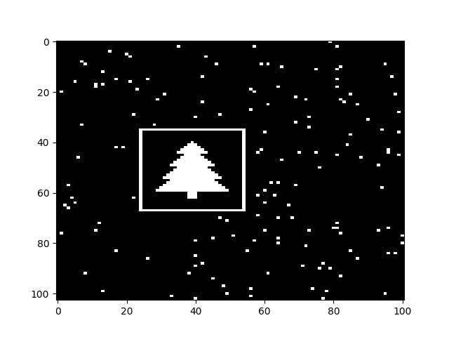

# Advent of Code 2024

Welcome to my solutions for [Advent of Code 2024](https://adventofcode.com/2024)! This repository contains my first attempts at solving AOC using **Python**.

## About Advent of Code

    

Advent of Code (AoC) is an annual event featuring 25 days of programming puzzles, released each day from December 1st to December 25th.

## Structure

- Each day's solution is stored in its own folder, named `day_XX/day_XX.py`.
- Input files (if used) are in the same folder (`day_XX_ex.txt` for the example, `day_XX_input.txt` for the input).
- Solutions are written in Python.